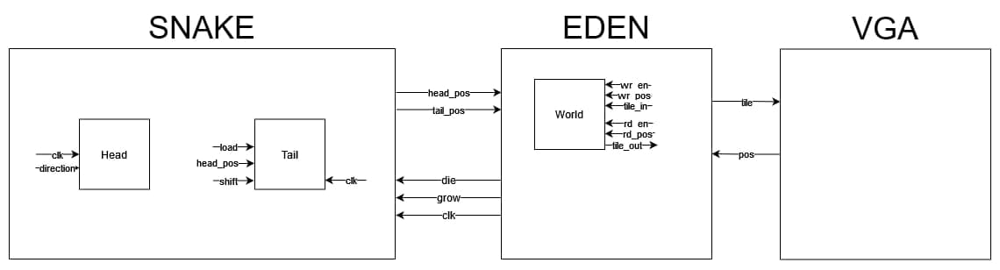
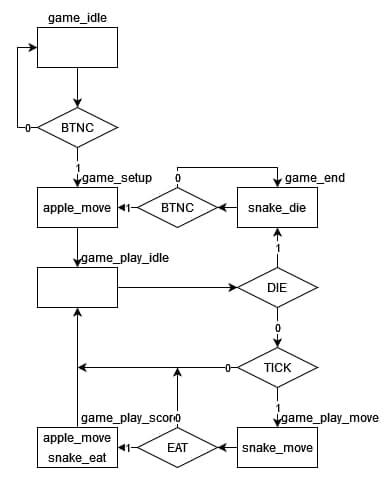
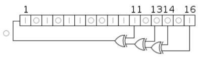

# snake-vhdl
VHDL implementation of the famous game "snake" for FPGA 
## Introduzione
### Idea di progetto

 

In seguito ad un'analisi di possibili progetti realizzabili con FPGA la nostra scelta è ricaduta su un videogioco storico presente anche nei primi cellulari, Snake.

Le origini di Snake risalgono agli anni settanta, da allora è stato prodotto in numerose piattaforme e varianti, fino a ritrovare nuova fama negli anni novanta grazie ai cellulari, il nostro obiettivo con questo progetto è quello di riprodurlo tramite il linguaggio VHDL rendendolo completo di interfaccia grafica. 

In snake il campo da gioco è spesso una matrice discreta di blocchi (tile) che nel caso più semplice essi possono assumere 3 stati: vuoto, mela o serpente. Supponendo che il campo di gioco sia rappresentato da una matrice 4x4, di seguito ve ne è la rappresentazione in 3 istanti consecutivi:

come si nota l’atto di mangiare una mela comporta l’aggiunta di un tile serpente in testa, mentre l’atto di muoversi comporta l’aggiunta in testa e la rimozione in coda, questo modello semplificato della logica di gioco sarà alla base del nostro progetto.

## Interfaccia utente 
L’interfaccia utente è formata da due macro componenti: i comandi di input e l’interfaccia grafica di output.

### Pulsanti
Per il controllo del serpente da parte del giocatore abbiamo optato per utilizzare i quattro pulsanti integrati sulla board, i pad direzionali riflettono la direzione che seguirà il serpente nel prossimo frame, mentre il pulsante centrale permette di far cominciare una nuova partita e di riavviare il gioco in caso di game over.

### Monitor VGA
La nostra scelta per la GUI ricade sulla porta VGA presente nella Nexys 4 DDR, il nostro codice è predisposto per supportare diverse risoluzioni tramite l’uso delle generics, la risoluzione più alta ufficialmente supportata è di 1280x1024 a 60fps, dandoci un pixel clock di 148.5 MHz ricavato dal clock base di 100.0 MHz tramite l’IP clock wizard di Xilinx.

## Grafica
### Griglia di gioco
La grafica di gioco è suddivisa in celle di 32x32 pixel configurabile tramite generics. Il serpente si muove in una griglia di XXxYY celle.

### Sprite
Ogni cella internamente è identificata da un numero che corrisponde ad un blocco di 8x8 pixel. Questi blocchi sono salvati in ROM e vengono letti durante la fase di rendering dove subiscono l’upscaling richiesto. Le ROM sono generate da uno script scritto in Python, che leggendo da un file PNG il valore del singolo pixel esegue la conversione al formato 12 bit per pixel (vedi Palette) creando un file sorgente VHDL contenente tutti i dati richiesti sotto forma di matrice che verrà sintetizzata come una cascata di multiplexers.

### Font
Per mostrare lettere e numeri a schermo sono stati creati sprite appositi. In memoria sono ordinati per essere accessibili facilmente in base al loro indice.

### Palette
L’adattatore VGA presente nella scheda offre 4 bit per canale (RGB) ovvero 163 = 4096 colori. Gli sprite sono stati disegnati su un computer che supporta colori con 8 bit per canale. Di conseguenza un processo di conversione è applicato al post-processing in Python per arrotondare un qualsiasi colore al più simile nel formato supportato.
Per progettare meglio gli sprite abbiamo usato un programma open-source specifico per creare pixel-art, Aseprite. In questo programma è infatti possibile specificare una palette arbitraria. Abbiamo quindi optato per utilizzare la palette di Amiga (Commodore, 1985), che in modalità HAL usava proprio 4 bit per canale.

### Simulazione grafica VGA
Il progetto è stato sviluppato per lo più da un team in remoto. Non avendo possibilità di testare il codice sull’unica scheda disponibile si è fatto uso estensivo di simulatori come GHDL. In particolare, per testare timing e output VGA è stato sviluppato un software nel linguaggio Rust che – interfacciandosi con la runtime di GHDL – produce output video su una finestra a schermo, simulando in tutto e per tutto un monitor VGA. 

Questa soluzione si è rivelata estremamente utile per ridurre i tempi di debug per le problematiche legate alla logica di rendering ed è stata anche condivisa con altri team per i loro progetti.

### Schema presentazione strutturale

Questo schema, semplificato per motivi di chiarezza, dà un’idea su quale sia la struttura del progetto, lo scheletro si compone principalmente di snake, eden e vga_renderer, dove snake fornisce in ogni momento la posizione della testa e della coda del serpente, eden gestisce la logica di gioco memorizzando tramite world lo stato corrente della matrice di gioco, e vga_renderer che permette l’upscaling e il rendering di sprite di dimensione 8x8.

## Strumenti utilizzati
### Strumenti Hardware
Board Nexys4 DDR
Monitor VGA
  
### Strumenti Software e Linguaggi
Vivado
GHDL e GTKWAVE
Visual Studio Code
Software di grafica aseprite
Scripting con Python
Simulatore VGA con Rust
# VHDL
L’intero progetto è strutturato in diversi blocchi funzionali comunicanti tra loro, partendo dai più semplici divisori/moltiplicatori di clock, per poter adattare il ritmo di gioco, ai più complessi dedicati alla gestione vera e propria del gioco o della porta VGA. 

## Logica
Di seguito sono descritti gli elementi strutturali più importanti, tralasciando quelli triviali o che hanno un compito di scarsa rilevanza.

### [eden.vhd]
Eden è la top level entity e gestisce direttamente la macchina di Moore degli stati di gioco.
Gli stati di gioco sono:
game_idle: il gioco è in attesa dell’input utente.
game_setup: inizializzazione del prng e posizionamento della mela.
game_play_idle: partita iniziata, in attesa del “tick” di aggiornamento.
game_play_move: aggiornamento dello stato di gioco, il serpente si muove.
game_play_score: la testa del serpente ha toccato la mela, viene aggiunto +1 allo score.
game_end: la testa del serpente ha toccato se stesso o il bordo del campo di gioco.

### [snake.vhd]
L’entity snake ha il compito di aggiornare lo stato del serpente, più nello specifico aggiorna la posizione della testa, collo e coda e delle loro sprite.
Tralasciando il collo, di cui ne viene tenuta traccia solo per motivi grafici, i due componenti essenziali sono la testa e la coda, infatti tramite essi è possibile simulare il movimento di una colonna di blocchi semplicemente aggiungendone uno davanti (la testa) e togliendo l’ultimo (la coda). Si deve sempre considerare il caso particolare nel quale il serpente si allunga dopo aver mangiato una mela, la coda infatti rimarrà ferma per un tick permettendo al serpente di crescere.
### [prng.vhd]
Il linguaggio VHDL non mette a disposizione strumenti per la generazione di numeri random o pseudo-random se non durante la simulazione. Abbiamo dunque deciso di implementare un generatore di numeri pseudo-random con un LSFR (Linear Feedback Shift Register).

Il seed del generatore viene inizializzato a 0 e ad ogni ciclo di clock viene incrementato di uno. Quando viene premuto il bottone di start del gioco, il valore del seed in quel momento diventa il valore definitivo del seed.
Ogni volta che viene richiesto un numero al generatore lo shift register mette in ingresso un nuovo bit determinato da una funzione di XNOR (funzione di retroazione). Il numero generato sarà quello contenuto nell’intero registro, e poi troncato a seconda del range richiesto. 
Poiché il registro ha un numero finito di stati, prima o poi i valori in uscita si ripetono, perciò bisogna scegliere una funzione di retroazione che abbia un periodo molto lungo. Xilinx mette a disposizione delle tabelle con le funzioni XOR e XNOR più efficienti (LFSR taps).

### [apple.vhd]
Tramite l’utilizzo di prng si occupa di tenere traccia e aggiornare la posizione della mela, infatti nel momento in cui essa viene mangiata vi è un semplice spostamento della stessa in una posizione che è funzione del prng, simulando così la creazione di una nuova.

### [world.vhd]
World non è altro che una matrice di identificativi per gli sprite che viene utilizzata dal renderer vga per ottenere lo sprite da renderizzare in una determinata posizione dello schermo. Scrittura e lettura sono abilitabili tramite rd_en e wr_en specificando la posizione (pos_in per la scrittura e pos_out per la lettura) della cella all’interno della matrice su cui si vuole eseguire l’operazione.

### [vga_controller.vhd]
Generazione dei segnali di vertical / horizontal sync definiti dallo standard VGA. Basandosi sulle specifiche del sito http://tinyvga.com/vga-timing/1280x960@60Hz abbiamo definito un segnale di clock usando l’IP Xilinx “Clock Wizard” corrispondente a quello indicato nella specifica e, utilizzando due counter per la posizione orizzontale e la posizione verticale per individuare i punti dove attivare (attivo basso) il segnale di sync.

### [vga_renderer.vhd]
Usando i valori dei contatori in [vga_controller.vhd] questa entità si occupa di caricare, leggere e inviare i pixel alla porta VGA.

## Conclusioni
Nonostante la presenza di qualche spigolo su cui avremmo voluto lavorare ulteriormente siamo estremamente soddisfatti del prodotto ottenuto. Fin dall’inizio il team si è dimostrato curioso di applicare i concetti discussi a lezione e di esplorare autonomamente altre tecniche di sviluppo. Infatti abbiamo scelto non a caso di ricreare un gioco per il nostro progetto, questa scelta infatti ci ha permesso di concentrarci su alcune importanti problematiche implementative non triviali, come la generazione del timing VGA, la gestione della macchina a stati di gioco o la generazione, scaling e rendering di sprite.
Durante la realizzazione del progetto sono emerse diverse problematiche che non solo ci hanno permesso di acquisire una discreta conoscenza del linguaggio VHDL ma anche di migliorare la nostra capacità di analisi e risoluzione di problemi complessi.
Il risultato finale per noi è un ottimo esempio di cosa sia possibile realizzare con linguaggio VHDL e l’FPGA.

